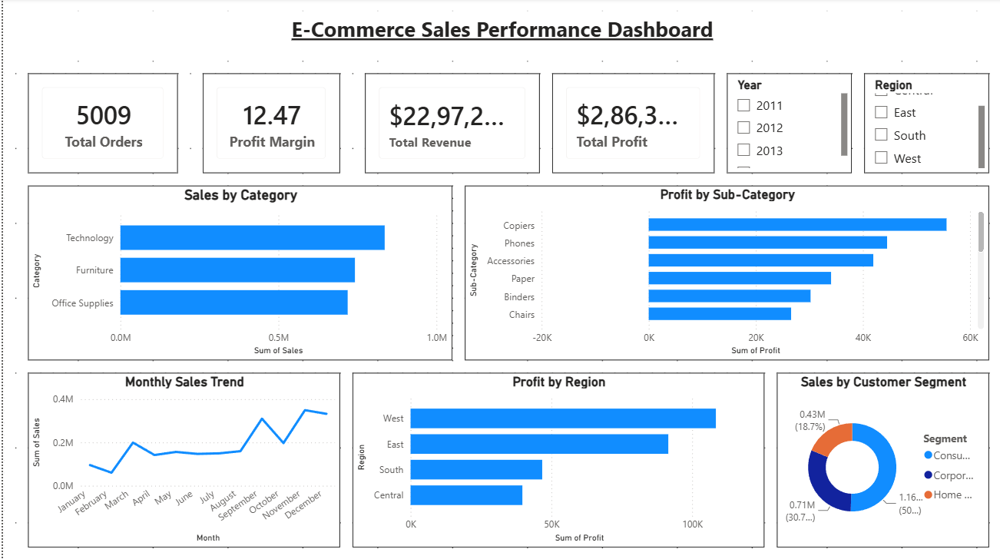
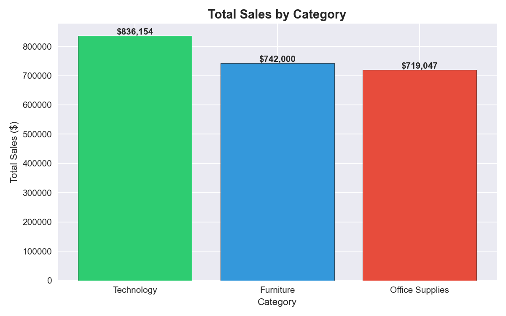
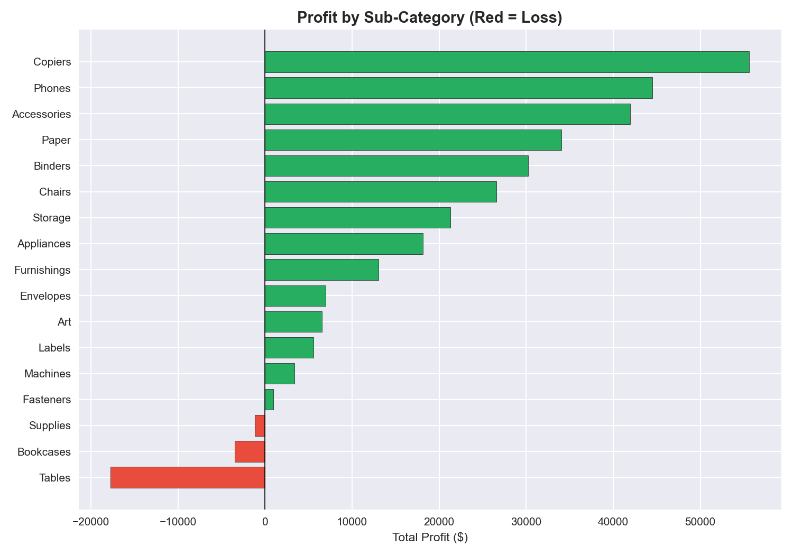
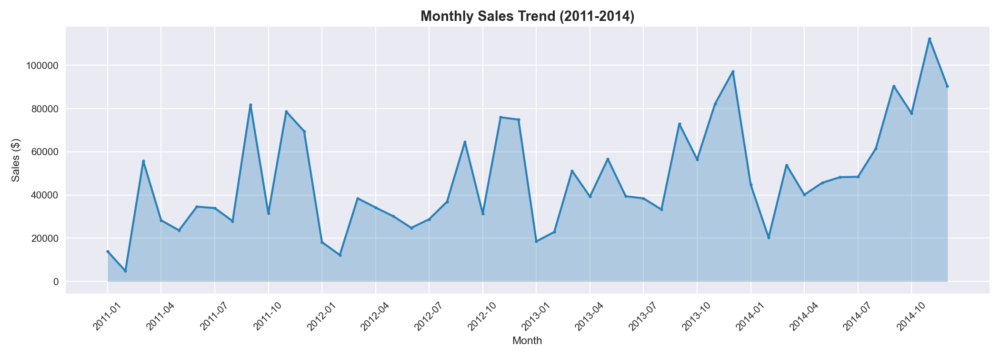
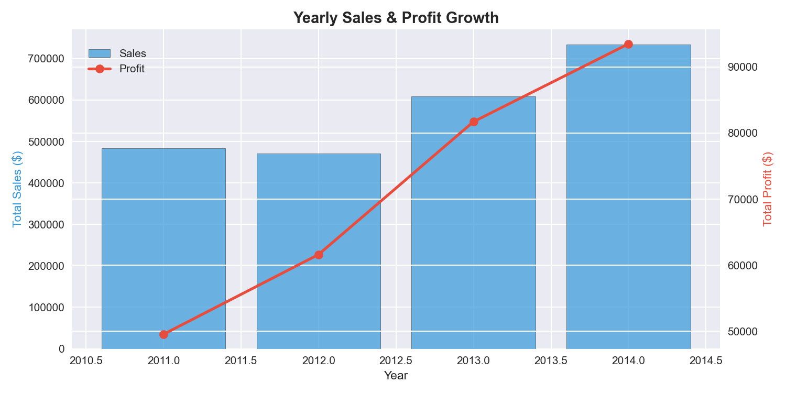
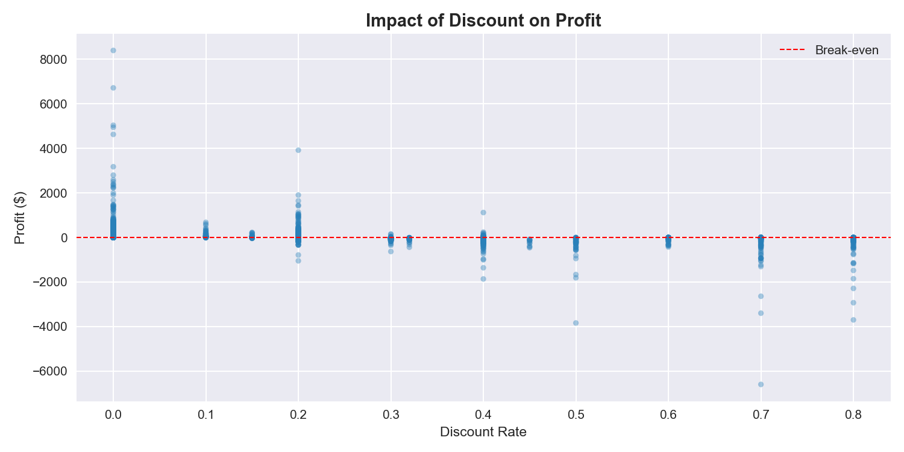

# 🛒 E-Commerce Sales Performance Analysis

## 📌 Project Overview
This project analyzes 4 years of e-commerce sales data from a 
US-based superstore to identify revenue trends, profit drivers, 
loss-making products, and regional performance — delivering 
actionable recommendations to improve business profitability.

---

## 🎯 Business Problem
> **"Which products, regions and customer segments are driving 
> growth — and where is the business losing money?"**

With $2.3M in revenue but only 12.5% profit margin, the business 
needed deeper insight into what was driving losses and where to 
focus for growth.

---

## 📊 Key Findings

| Insight | Finding |
|---|---|
| 💰 Total Revenue | $2,297,200 over 4 years |
| 📈 Total Profit | $286,397 (12.5% margin) |
| 🏆 Best Category | Technology ($145,454 profit) |
| ❌ Loss Making | Tables (-$17,725), Bookcases (-$3,472) |
| 🌍 Best Region | West ($725,457 in sales) |
| 📅 Best Year | 2014 ($733,947 in sales) |
| 🏙️ Top State | California ($457,687) |
| ⚠️ Discount Loss | $122,615 lost from high discounts |

---

## 💡 Business Recommendations

1. **Stop heavy discounting** — 1,139 orders with 40%+ discount 
   caused $122,615 in losses. Cap discounts at 20%.
2. **Review Tables & Bookcases pricing** — Both sub-categories 
   are consistently loss-making. Review supplier costs or 
   discontinue low-margin products.
3. **Invest more in Technology** — Highest profit category with 
   strong margins. Expand product range.
4. **Focus on West & East regions** — These drive the most 
   revenue. Prioritize marketing spend here.
5. **Target Consumer segment** — Largest customer base with 
   strong growth potential.

---

## 🛠️ Tools Used

---

## 📁 Project Structure

---

## 📈 Visualizations

### Sales by Category

### Profit by Sub-Category

### Monthly Sales Trend

### Yearly Growth

### Discount vs Profit Impact

---

## 🗄️ SQL Analysis
Key business questions answered using SQL:
- Total revenue, profit and margin calculation
- Sales and profit breakdown by category
- Loss making sub-category identification
- Regional sales and profit analysis
- Yearly sales growth trends
- Discount impact on profitability
- Top 10 states by sales
- Customer segment performance

---

## 📌 Dataset
- **Source:** Sample Superstore Dataset
- **Platform:** Kaggle
- **Records:** 9,994 orders | 21 features
- **Period:** 2011 — 2014

---

*Created by Priyanka M M | Bengaluru, India*
*Tools: Python • SQL • Power BI*
